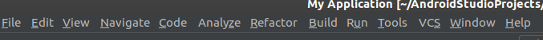
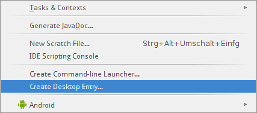

# Android Studio no Linux
Repositório simples para servir como guia para instalação do Android Studio no Linux Ubuntu, a versão que estou utilizando é a 18.04.  
  
## Guia
* [0. Instalando o JDK8](#0-instalando-o-jdk8)
* [0.1. Instalando bibliotecas 32 bits](#01-instalando-bibliotecas)
* [1. Baixando o arquivo](#1-baixando-o-arquivo)
* [2. Descompactando](#2-descompactando)
* [3. Instalando](#3-instalando)
* [4. Adicionando ao launcher](#4-adicionando-ao-launcher)
* [5. Adicionando à Área de Trabalho](#5-adicionando-à-área-de-trabalho)
  
## 0. Instalando o JDK8
Antes de começar a instalação do Android Studio é necessário instalar o Java Development Kit 8 (pelo menos para o React Native), então se ainda não instalou, eu já fiz um tutorial que pode ser [acessado por aqui](https://github.com/mayraamaral/jdk8-linux). Caso já tenha instalado ignore essa parte e siga com o resto dos passos.  
  
## 0.1. Instalando bibliotecas
Antes de instalar o Android Studio é necessário instalar algumas bibliotecas 32 bits para o funcionamento correto.  
No terminal, cole os códigos abaixo:  
  
```sudo apt-get install libc6:i386 libncurses5:i386 libstdc++6:i386 lib32z1 libbz2-1.0:i386```  
  
```sudo apt-get install libncurses5```  
  
Depois prossiga.  
## 1. Baixando o arquivo
Baixe o arquivo .tar.gz no [site do Android Studio](https://developer.android.com/studio).  
  
Para facilitar, renomeie o arquivo baixado para "android-studio".  
  
## 2. Descompactando
Descompacte esse arquivo .tar.gz dentro da pasta /usr/local conforme instrui no site do Android Studio, para isso, use o seguinte código:  
  
```sudo tar -zxvf android-studio.tar.gz -C /usr/local```  
  
Vale lembrar que para descompactar você precisa estar dentro do diretório em que o arquivo está, por exemplo, se o arquivo android-studio.tar.gz está em Downloads, você (o terminal no caso) precisa estar nesse diretório para descompactar.  
  
## 3. Instalando
Agora acesse a pasta **bin** dentro da pasta android-studio que foi criada:  
  
```cd /usr/local/android-studio/bin```  
  
Execute o código a seguir para instalar:  
  
```./studio.sh```  
  
Depois disso, o instalador do programa será aberto e é só instalar de acordo com as suas preferências.  
**Após finalizar a instalação NÃO feche o Android Studio ainda**  
  
## 4. Adicionando ao launcher
Para criar um "atalho" do Android Studio permitindo que seja possível acessá-lo através do buscador de programas, entre no Android Studio que foi aberto após a instalação e crie um projeto, depois vá em Tools (no menu superior), conforme mostra a imagem:  
  
  
  
Clique em "Create desktop entry" ou algo parecido com isso, conforme mostra abaixo:  
  
  
  
Pronto, está feito, um arquivo chamado **jetbrains-studio.desktop** foi adicionado ao /usr/share/applications.
  
## 5. Adicionando à Área de Trabalho
Depois de ter adicionado ao launcher, para adicionar à Área de Trabalho, execute os seguintes códigos:  
  
```sudo chmod +x /usr/share/applications/jetbrains-studio.desktop```  
  
Depois esse código:  
  
```cp /usr/share/applications/jetbrains-studio.desktop ~/Área\ de\ Trabalho/```  
  
Espero que tenha sido útil.
